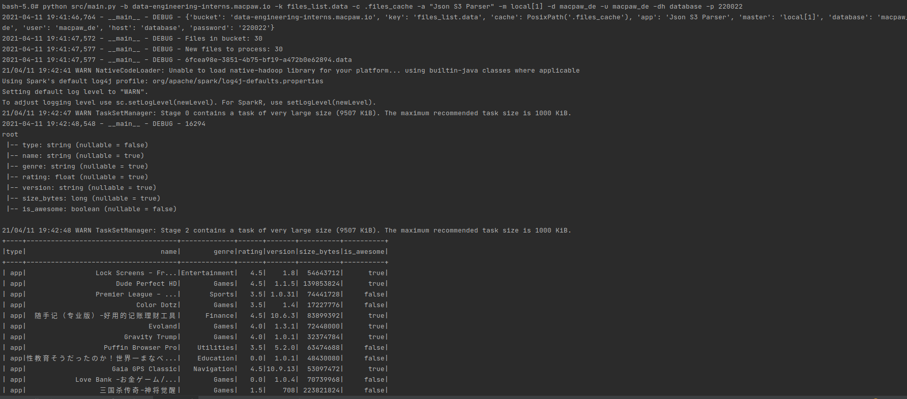
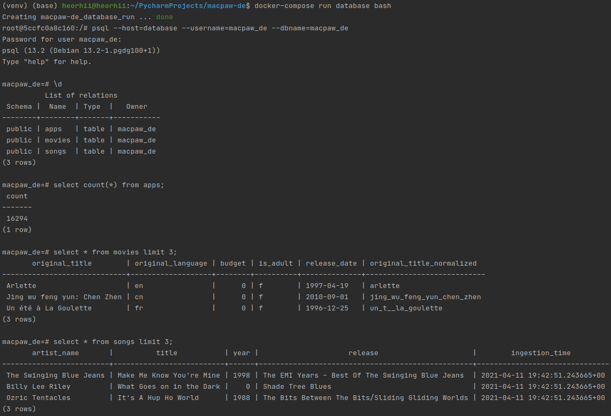
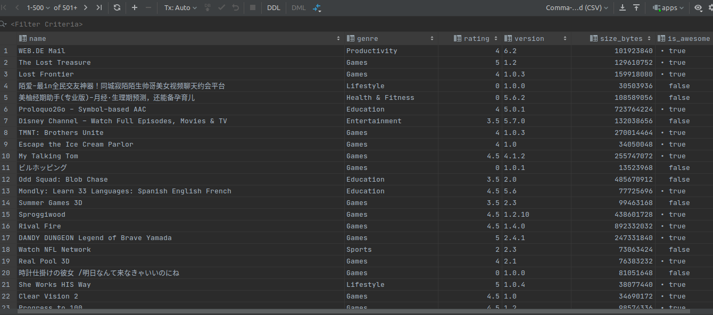
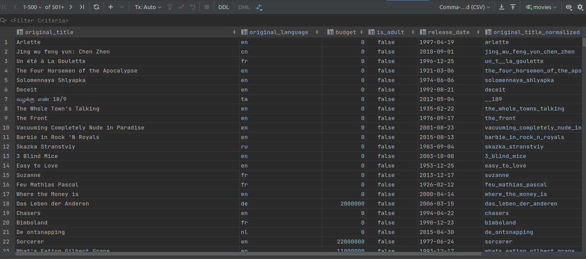
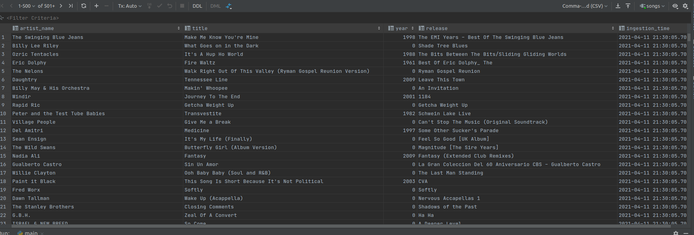

Dockerhub available  
```shell
docker pull beefmilf/macpaw-de_etl:interactive_etl
```

## Terminal 1 
Bring up the database
```shell
docker-compose up
```

## Terminal 2
Drop into the container shell
```shell
docker ps
docker exec -it macpaw-de_etl_1 bash
```
Check some files or go futher  
```shell
ls
ls ~/.aws/ # boto3 requires credentials  
echo $PYTHONPATH # :/macpaw-de/src
which java 
java -version
find . -name *.jar # ./postgresql-42.2.10.jre6.jar
cat .files_cache 
```
Run pipeline, it will take some time
```shell
# script stores new filenames into ".files_cache"
# script creates database and tables if not exists
rm .files_cache 
python src/main.py -b data-engineering-interns.macpaw.io -k files_list.data -c .files_cache -a "Json S3 Parser" -m local[1] -d macpaw_de -u macpaw_de -dh database -p 220022
```

## Terminal 3
Check database, tables exist and data is uploaded  
```shell
# drop into the container shell
docker-compose run database bash
# use the psql client
psql --host=database --username=macpaw_de --dbname=macpaw_de
# list tables 
\d
# count lines 
select count(*) from apps;
```

## Other 
Remove docker 
```shell
docker images
docker-compose down 
# destroy the volume and its data
docker-compose down --volumes

docker tag 07569f0b3991 beefmilf/macpaw-de_etl:interactive_etl
docker push beefmilf/macpaw-de_etl:interactive_etl
```

After running **main.py** pipeline you will see something like 




And check database 



Apps DB 



Movies DB 



Songs DB 

